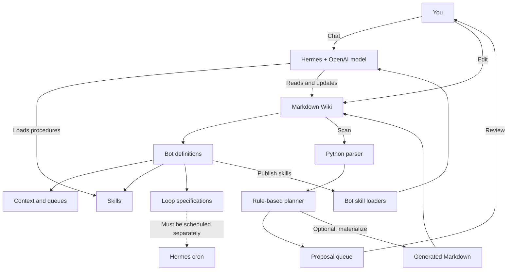

# Workflow

```mermaid
flowchart TD
    U[You] -->|Chat| H[Hermes + OpenAI model]
    U -->|Edit| W[Markdown Wiki]

    W --> B[Bot definitions]
    B --> C[Context and queues]
    B --> S[Skills]
    B --> L[Loop specifications]

    B -->|Publish skills| P[Bot skill loaders]
    P --> H
    H -->|Loads procedures| S
    H -->|Reads and updates| W

    W -->|Scan| PA[Python parser]
    PA --> PL[Rule-based planner]
    PL --> Q[Proposal queue]
    Q -->|Review| U

    PL -->|Optional: materialize| F[Generated Markdown]
    F --> W

    L -.->|Must be scheduled separately| CR[Hermes cron]
```

Hermes handles conversation; the Python planner produces proposals. Loop
specifications do not run automatically.